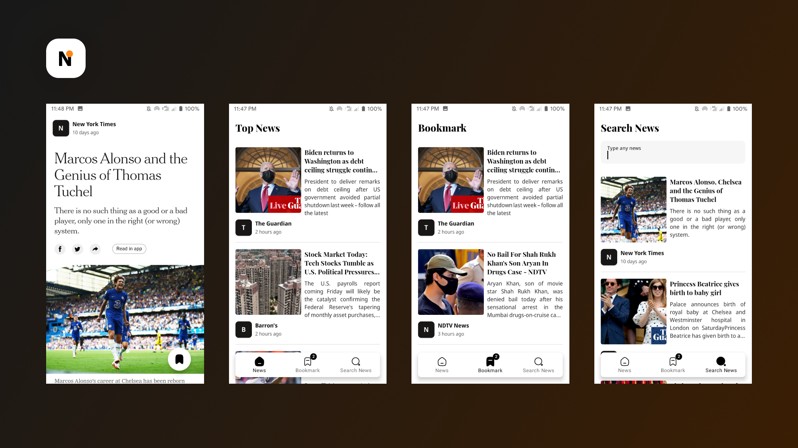

Today News App
==
Today News App is a modular Android application built to showcase clean architecture, modularization, and MVVM design pattern principles. It provides a user-friendly interface to browse and read the latest news articles from various categories such as business, technology, sports, entertainment, and more.

Screenshots
-----------  


Technologies Used: :
--------------  
* **Clean Architecture**: The project implements the principles of clean architecture to separate the business, presentation, and data layers. This enables easier testing and flexibility in swapping out layer implementations.
* **Modularization**: The application employs a modularization approach to divide the project into separate modules, such as domain, presentation, and data. Each module has clear responsibilities and can be developed independently.
* **MVVM (Model-View-ViewModel)**: The MVVM architecture is utilized to separate the business logic from the view. The Model represents data and business rules, the View is the user-visible interface, and the ViewModel is responsible for preparing and delivering data to the View.
* LiveData
* Room Database
* **Lottie** - Render After Effects animations natively on Android and iOS, Web, and React Native ([Lottie](https://github.com/airbnb/lottie-android))
* Kotlin Flow
* **Flow Binding** ([FlowBinding](https://github.com/ReactiveCircus/FlowBinding) - Kotlin Coroutines Flow binding APIs for Android's platform and unbundled UI widgets, inspired by RxBinding.)
* **buildSrc** : for dependency management to centralize and simplify dependencies configuration.
* Kotlin Coroutines
* Glide
* Navigation Component
* ViewModel
* Lifecycles Components
* Retrofit
* **Paging 3** ([Paging Documentation](https://developer.android.com/topic/libraries/architecture/paging/v3-overview?hl=id))
* **Dagger Hilt** for dependency injection and managing object dependencies. ([Dagger Hilt Docs](https://dagger.dev/hilt/))

News API key
------------  
Today News App uses the [News API](https://newsapi.org/docs/get-started) to load news. To use the API, you will need to obtain a free developer API key. See the  
[News API Documentation](https://newsapi.org/docs) for instructions.

### Setup API Key
Add api key into your `local.properties` file:

```gradle  
API_KEY=YOUR_API_KEYS  
```  

# License
```xml
Designed and developed by 2021 arrazyfathan (Ar Razy Fathan Rabbani)

Licensed under the Apache License, Version 2.0 (the "License");
you may not use this file except in compliance with the License.
You may obtain a copy of the License at

   http://www.apache.org/licenses/LICENSE-2.0

Unless required by applicable law or agreed to in writing, software
distributed under the License is distributed on an "AS IS" BASIS,
WITHOUT WARRANTIES OR CONDITIONS OF ANY KIND, either express or implied.
See the License for the specific language governing permissions and
limitations under the License.
```